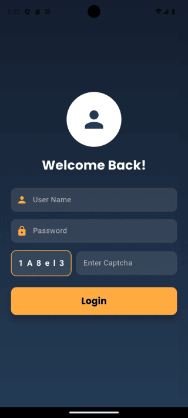

# Demo Designs

A new Flutter project containing some demo login screen designs.

## Overview
This project showcases three different login screen design templates, demonstrating various UI/UX approaches for authentication screens in Flutter.

## Screenshots
Below are the screenshots of the three login screen designs:

### Design 1


### Design 2


### Design 3


## Features
- Three different login screen UI designs.
- Responsive and adaptable layouts.
- Customizable UI components.
- Easy to integrate into any Flutter project.

## Installation
1. Clone the repository:
   ```sh
   git clone https://github.com/nibha181/demo_designs.git
   ```
2. Navigate to the project directory:
   ```sh
   cd demo_designs
   ```
3. Install dependencies:
   ```sh
   flutter pub get
   ```
4. Run the project:
   ```sh
   flutter run
   ```

## Dependencies
Ensure you have Flutter installed. You can check your Flutter installation with:
```sh
flutter doctor
```

## Contributing
Feel free to contribute by creating pull requests or opening issues.

## License
This project is licensed under the MIT License.


